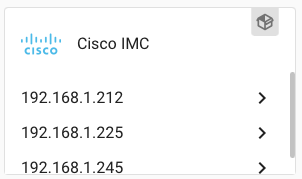
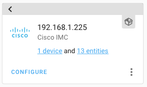
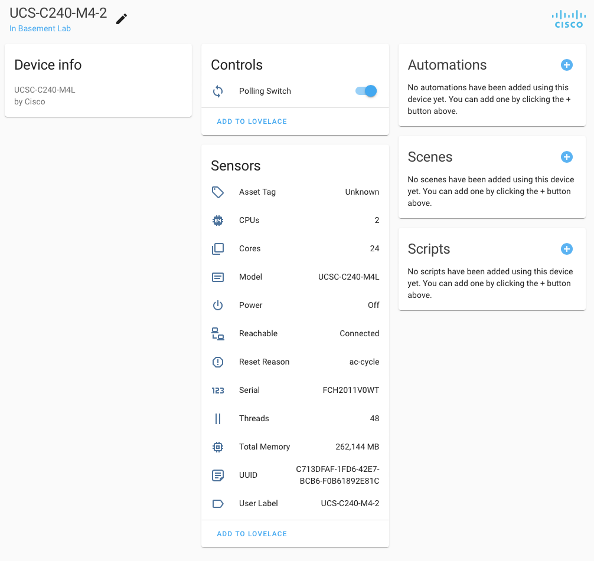

[](https://github.com/custom-components/hacs)

---
# A [Cisco](https://www.cisco.com) UCS Server IMC integration for [Home Assistant](https://github.com/home-assistant).  

---

# Purpose

The purpose of this code is to create a [Home Assistant](https://github.com/home-assistant) integration to provide high-level, rack-unit data from the CIMC, and to allow an administrator to set the UCS server's desired admin power state.  This integration utilizes the [Cisco](https://www.cisco.com) [imcsdk](https://github.com/CiscoUcs/imcsdk) for Python.
This code is loosely based on the [Home Assistant custom components integration blueprint](https://www.github.com/custom-components/integration_blueprint), and the [Home Assistant integration for Tesla buy alandtse](https://github.com/alandtse/tesla).





**INFO**

**To my knowledge, this works with Cisco:**
    
UCS-C240M4 IMC version 4.1(2f) and above.

UCS-EN120S-M2 IMC version 3.1(1.2016) and above.

---


# Adding the integration

1. Install [HACS](https://hacs.xyz/)
2. Go to Community > Custom repositories > 
3. Search for Cisco IMC
4. Add the Cisco IMC repository
5. Download the Cisco IMC repository
6. Restart Home Assistant
7. In the HA UI go to "Configuration" -> "Integrations" click "+" and search for "Cisco IMC"
8. Fill out the information according to [this instruction](#integration-configuration).
9. You will now have a new integration for Cisco IMC.


# Entities
Creates multiple sensors based on default-level rack unit data from the IMC. This includes a sensor to indicate the UCS server's power state.  Additionally, a binary sensor is created to indicate if the IMC is reachable, and a switch is created to allow toggling the integration's polling of the IMC.


# Services
Creates a service that allows you to set the UCS server's desired admin power state.

# Translation
Translations are done via [Lokalise](https://app.lokalise.com/public/260939135f7593a05f2b79.75475372/). If you want to translate into your native language, please [join the team](https://app.lokalise.com/public/260939135f7593a05f2b79.75475372/).

# Troubleshooting

If you have problems with the integration you can add debug information to the log.

```yaml
logger:
  default: info
  logs:
    custom_components.cisco_imc: debug
```

If you are having issues and want to report a problem, always start with making sure that you're on the latest version of the both the integration and Home Assistant.

# <a name="integration-configuration"></a>Integration configuration

### Config Explanation:

Field           						| Description
----------------------------|------------
**Cisco UCS IMC IP Address**   						| (required) The IP address of the IMC.  Must be reachable when configured.
**IMC Username**										| (required)
**IMC Password**  								| (required)
**Seconds between polling**					| (optional) The frequency for polling the IMC (defaults to a minute).
